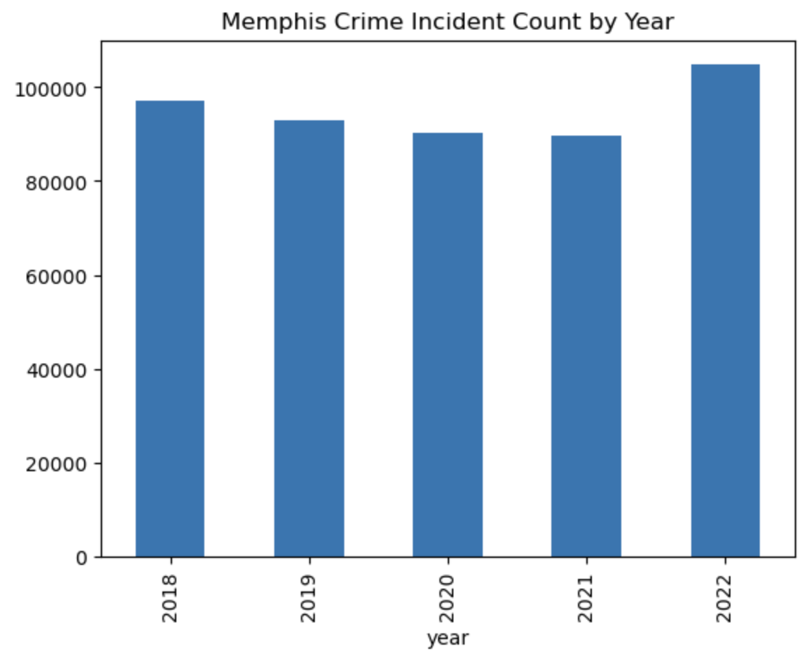
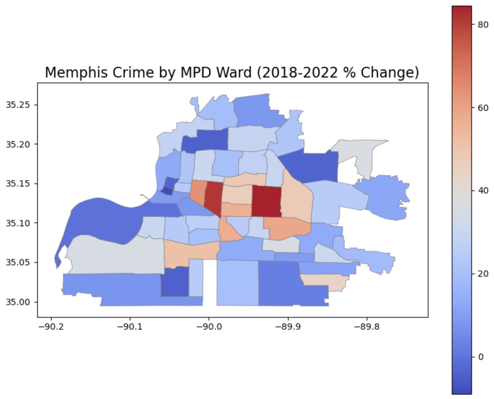

# Geographic Analysis of Memphis Crime
- Objective: The goal of this project is to analyze how the level and locality of crime has changed over time in Memphis
- Initial hypothesis: Besides changes in aggregate crime levels, the relative densities across neighborhoods have shifted.

- Data sources:
    - [Memphis Police Department: Public Safety Incidents](https://memphisinternal.data.socrata.com/Public-Safety/Memphis-Police-Department-Public-Safety-Incidents/ybsi-jur4) (downloaded 2/5/2023)
    - [Memphis Police Department Wards](https://data.memphistn.gov/Public-Safety/Memphis-Police-Department-Wards/rqqz-pj4u)
