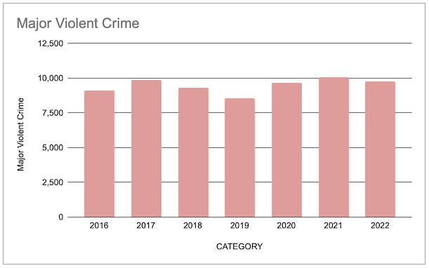
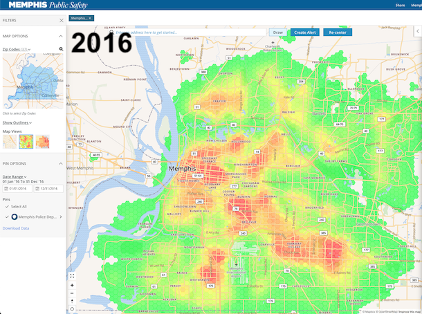
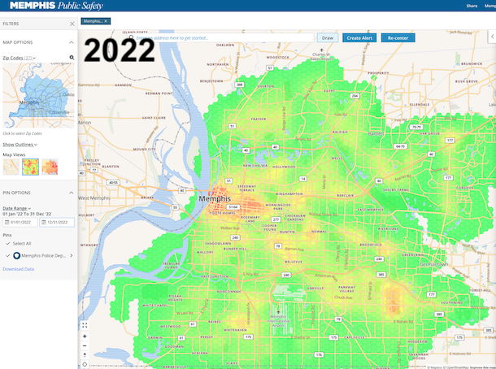

# Geographic Analysis of Memphis Crime
- Objective: The goal of this project is to analyze how the level and locality of crime has changed over time in Memphis
- Initial hypothesis: although the aggregate levels of crime in Memphis have not changed dramatically, the relative densities across neighborhoods have shifted.

Overall crime levels appear steady:

However, crime appears to be less concentrated and more diffused across the city. See the 
comparison below between 2016 and 2022 from the MPD-provided online data mapping tool. This 
view obscures the increase in crime in certain areas.

I intend to produce graphics that make more clear the shifts in the location of crime activity 
in the city, especially the increases in previously safer areas.

- Datasource: [Memphis Police Department: Public Safety Incidents](https://memphisinternal.data.socrata.com/Public-Safety/Memphis-Police-Department-Public-Safety-Incidents/ybsi-jur4) (downloaded 2/5/2023)
