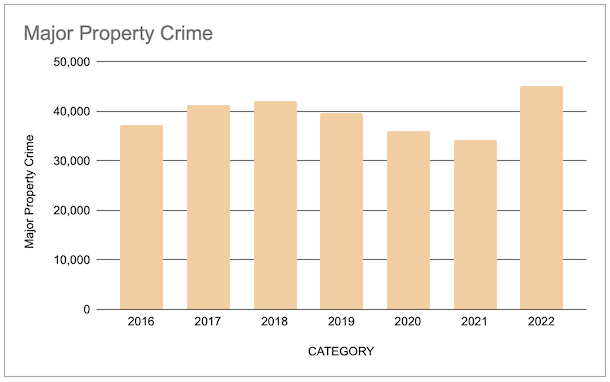

# Geographic Analysis of Memphis Crime
- Objective: The goal of this project is to analyze how the level and locality of crime has changed over time in Memphis
- Initial hypothesis: although the aggregate levels of crime in Memphis have not changed dramatically, the relative densities across neighborhoods have shifted.

- Datasource: [Memphis Police Department: Public Safety Incidents](https://memphisinternal.data.socrata.com/Public-Safety/Memphis-Police-Department-Public-Safety-Incidents/ybsi-jur4) (downloaded 2/5/2023)